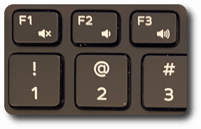

# Disable Numerical Keyboard Shortcuts on YouTube 

## What?

This is a Firefox extension which disables the `0`-`9`, `Home` and `End`
keyboard shortcuts on YouTube, which seek to a percentage of the video, i.e.
the `0` key seeks the beginning of the video, the `1` key seeks to 10%, etc.

## Why?

The volume control keys on my laptop are directly above the numbers:

Sometimes when I change the volume I accidentally press a number key which
seeks to a different place in the video I am watching and causes me to lose my
place. I have never used the number shortcuts to seek to a point in a video on
purpose, so the easy solution is to disable the number keyboard shortcuts.
